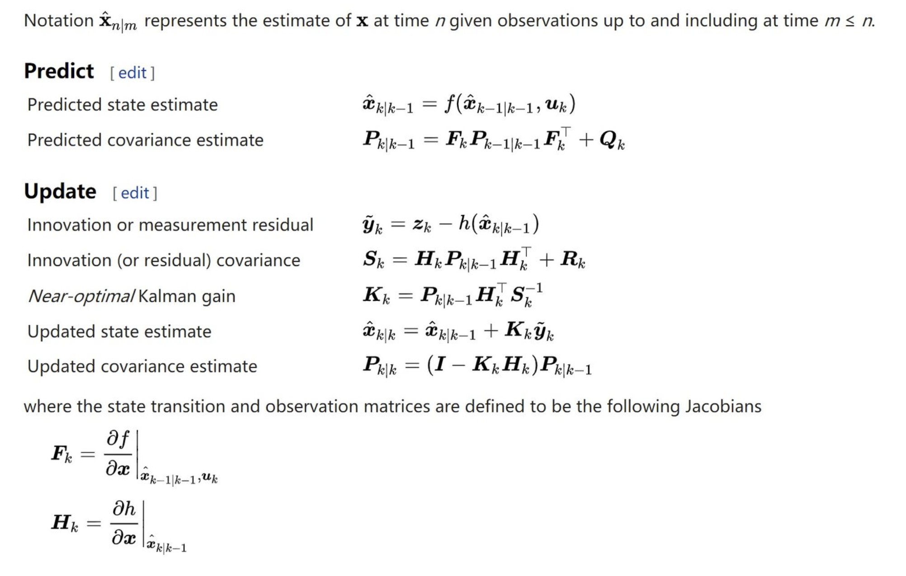
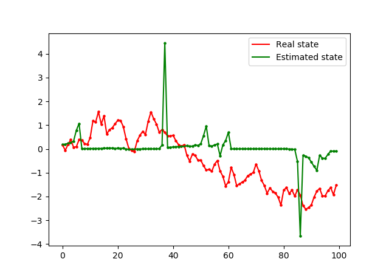

# Extend Kalman Filter(扩展Kalman滤波)

## 一、Extend Kalman Filter(EKF)介绍
Kalman filter 处理的是线性高斯模型，Extend Kalman filter是利用 Kalman filter处理非线性模型的最直接的推广。
其核心思想就是就用一阶Taylor展开线性逼近。由于这是一个迭代算法，而每次迭代步的时候去逼近FK和HK ,
所以除了一些特殊情况，效果不会太差。EKF具体算法如下所示：

可以看到EKF实质上就是对非线性函数进行了一阶Taylor逼近(求Jacobi矩阵)，进而在每一步都转换成一个标准的Kalman Filter。

## 二、效果

可以看到用EKF进行非线性系统的滤波效果并不是非常好，建议使用粒子滤波。

## 三、参考资料
[1] [https://zhuanlan.zhihu.com/p/134244047](https://zhuanlan.zhihu.com/p/134244047)

