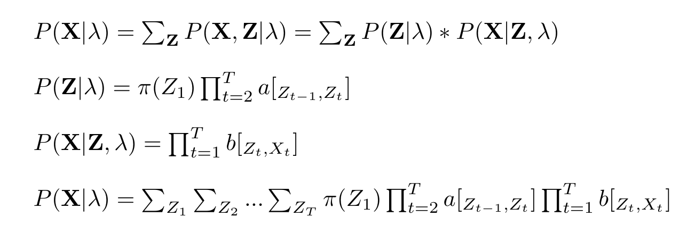
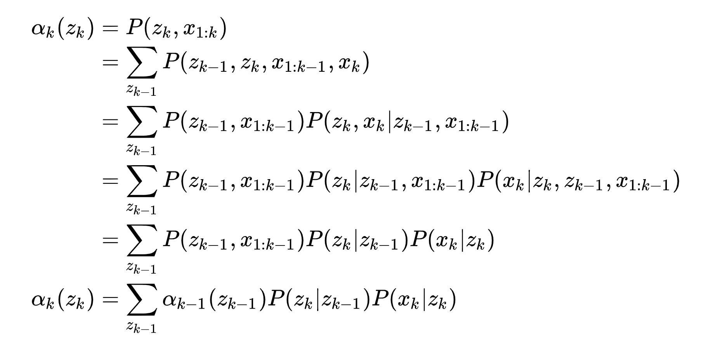
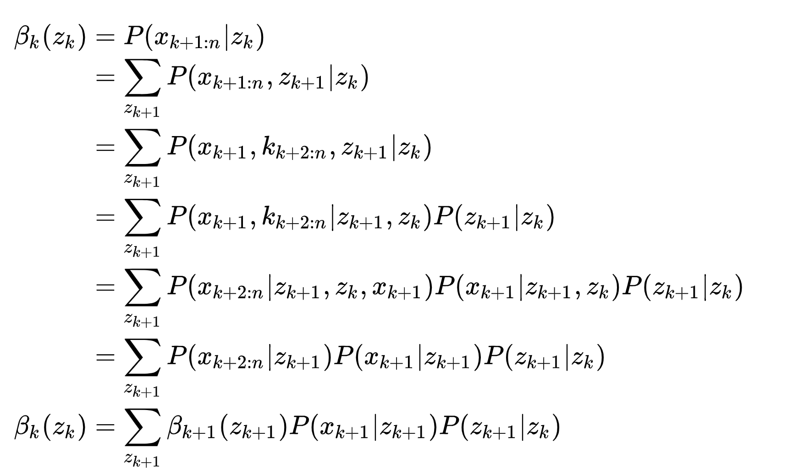

# Hidden Markov Model(HMM)
## 一、介绍

[README.md](../README.md)中介绍了HMM与其它两个模型之间的区别与联系。HMM与其它两个模型最大的区别在于其状态空间是离散的，因此HMM的状态转移概率可以用
一个矩阵A表示，其中aij = P(Zt=qj | Zt=qi)，该矩阵称为***状态转移矩阵***(Transition Matrix)，满足每一行的和为1。HMM对观测空间
的取值离散或连续没有规定，这里假设它也是离散的，可以用矩阵B表示观测概率，bij = P(Xt=vj|Zt=qi)，称为***发射矩阵***(Emission Matrix)，
发射矩阵同样满足每行和为1。再加上Z1系统状态的初始分布π，称λ = (π, A, B)为HMM模型的参数。HMM是一种产生式模型、无监督学习模型，是RNN之前人们最常用来做NLP任务的模型。
## 二、HMM关注的问题

### 2.1 Evaluation 

给定模型参数λ的情况下，求似然函数P(X|λ)，相应的算法为前向算法(Forward Algorithm)和后向算法(Backward Algorithm)。前向算法和后向算法都是
通过递推降低似然函数计算复杂度的算法。

#### 2.1.1 直接求P(X|λ)

直接求解似然分布的公式如下所示:

假设状态变量Z共有N个状态，则可以看出直接求的话要进行NT次加法，复杂度是程指数增加的。

#### 2.1.2 Forward算法和Backward算法

Forward算法和Backward算法都是动态规划算法，将直接求和变成某种递推的形式，计算复杂度降为O(TN2)。Forward算法的递归形式如下所示，可以看到它是从动态系统的初始值开始向前递归的，因此叫Forward算法。

Backward算法的递归形式如下所示，它是从动态系统的终止值开始向后递归的，因此叫Backward算法。

### 2.2 Learning

λMLE = argmax P(X|λ)

模型中含有隐变量，用EM算法求解(在HMM中又称为Baum-Welch算法)。由于只有观测变量，没有隐变量作为标签，HMM的learning problem是一个无监督学习问题。

### 2.3 Decoding

***<u>Z</u>*** = argmax P(Z1, Z2, ... ,Zt|X1, X2, ... ,Xt, λ)

Decoding问题采用Viterbi算法求解，Viterbi算法是一种求最短路径的动态规划算法，而求解
***<u>Z</u>*** = argmax P(Z1, Z2, ... ,Zt|X1, X2, ... ,Xt, λ)问题可以看成从Nt条路径中选出一条概率最大(最短的)路径。

### 2.4 补充
除了以上问题之外，HMM还可以求解Filtering问题、Smoothing问题和Prediction问题，这里不在赘述。

## 四、参考
1. Bishop C M . Pattern Recognition and Machine Learning (Information Science and Statistics)[M]. Springer-Verlag New York, Inc. 2006.(13章)
2. [https://zhuanlan.zhihu.com/p/98397735](https://zhuanlan.zhihu.com/p/98397735)
3. [https://www.cs.sjsu.edu/~stamp/RUA/HMM.pdf](https://www.cs.sjsu.edu/~stamp/RUA/HMM.pdf)
