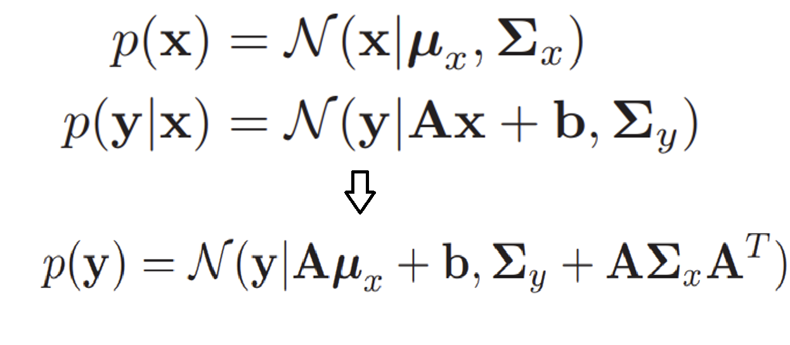
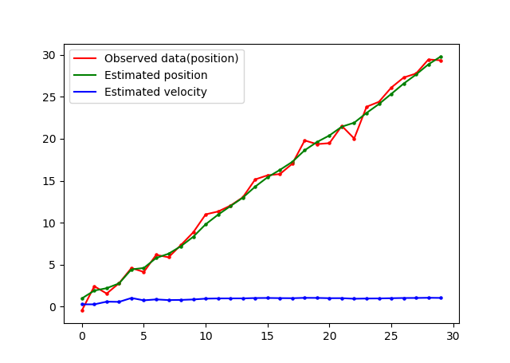

# Linear Dynamic System(Kalman filter)
## 一、介绍
[README.md](../README.md)中介绍了线性动态系统与其它两个模型之间的区别与联系，线性动态系统认为观测变量和状态变量服从高斯分布，
且变量之间满足如下线性关系(故又称为线性高斯模型):

Zt = AZt-1 + B + ε &nbsp;&nbsp;&nbsp;&nbsp;(1)

Zt = CXt + δ  &nbsp;&nbsp;&nbsp;&nbsp;(2)

ε和δ代表噪声变量，且ε~ N(0, Q), δ~ N(0, R)。则Zt | Zt-1~N(AZt-1 + B, Q)，
Xt | Zt ~ N(CZt, R)，另外，初始状态Z1~N(μ1, Σ1)。

综上，线性动态系统的参数为***θ*** = (A, B, C, Q, R, μ1, Σ1)。**注意**公式2没有常数项，
因为可以给状态变量添加一个齐次坐标，这样做可以让推出的公式更简洁。

## 二、解决的问题
### 2.1 Inference问题
[README.md](../README.md)4.2节的Inference问题中，线性动态系统要解决的就是filtering问题，即求P(Zt|X1, X2, ... ,Xt)。
由Bayes公式和动态模型的假设可得:

P(Zt|X1, X2, ... ,Xt) ∝ P(Zt|X1, X2, ... ,Xt-1)P(Xt|Zt) &nbsp;&nbsp;&nbsp;&nbsp;(1)

其中求P(Zt|X1, X2, ... ,Xt-1)是一个prediction问题，且满足:

P(Zt|X1, X2, ... ,Xt-1) = ∫ P(Zt-1|X1, X2, ... ,Xt-1)P(Zt|Zt-1)dZt-1 &nbsp;&nbsp;&nbsp;&nbsp;(2)

### 2.2 求解线性动态系统模型的步骤

根据2.1节的公式(1)和(2)，线性动态系统模型分为预测(prediction)和更新(update)两步:

***step 1. 预测(prediction)***

P(Zt|X1, X2, ... ,Xt-1) = ∫ P(Zt-1|X1, X2, ... ,Xt-1)P(Zt|Zt-1)dZt-1 

代入高斯分布得：

N(Zt | μt|t-1, Σt|t-1) = ∫N(Zt-1 | AZt-1 + B, Q) * 
N(Zt | μt-1|t-1, Σt-1|t-1)dZt-1 

***step 2. 更新(update)***

P(Zt|X1, X2, ... ,Xt) ∝ P(Zt|X1, X2, ... ,Xt-1)P(Xt|Zt) 

代入高斯分布得：

N(Zt | μt|t, Σt|t) ∝ N(Zt | μt|t-1, Σt|t-1) * 
N(Xt | CZt, R) 

### 2.3 线性动态系统的闭式解

由于多元高斯的联合、边缘、条件分布都是高斯分布，因此参数的更新有闭式解，对应如下：

***step 1. 预测(prediction)***

由如上关系可得，预测步参数更新公式为:

(1) μt|t-1 = A * μt-1|t-1 + B

(2) Σt|t-1 = A * Σt-1|t-1 * AT + Q

***step 2. 更新(prediction)***

对于相同量纲的两个高斯分布的乘积

N(x|μ*, Σ*) = N(x|μ1, Σ1) * N(x|μ2, Σ2)

参数关系如下:

μ* =  (Σ2-1 + Σ1-1)-1
(Σ1-1 * μ1 + Σ2-1 * μ2) = μ1 + Σ1(Σ1 + Σ2)-1(μ2 - μ1)

Σ* =  (Σ2-1 + Σ1-1)-1 = Σ1 - Σ1(Σ1 + Σ2)-1Σ1

更新步即两个高斯分布相，但要注意的是需要统一量纲：

N(Xt | C * μt|t, C * Σt|t * CT) ∝ N(Xt | C * μt|t-1,  C * Σt|t-1* CT) 
N(Xt | CZt, R) 

综上，更新步的参数更新规则为：

(1) 计算Kalman增益
 
Kt = Σt|t-1 * CT * (R + C * Σt|t-1 * CT)-1

(2) 更新方差矩阵

Σt|t = (Σt|t-1-1 + CTR-1C)-1 = Σt|t-1 - Kt * C * Σt|t-1

(3) 更新均值向量

μt|t = μt|t-1 + Kt(Xt - C*μt|t-1)
 

## 三、效果
参考资料[1]中给的估计小车一维运动速度和时间的例子：

## 四、总结
Kalman filter的初始参数Q,R,Z0,SIGMA0都会对最终滤波后的效果产生影响，其中Q,R的影响对滤波效果的影响较大，往往需要调参。如果状态转移矩阵的准确度较高，则设置较小的Q矩阵；如果观测矩阵的准确度较高，则设置较小的R矩阵。

## 五、参考资料
[1] Faragher R . Understanding the Basis of the Kalman Filter Via a Simple and Intuitive Derivation [Lecture Notes][J]. IEEE Signal Processing Magazine, 2012, 29(5):128-132.

[2] Machine Learning: A Probabilistic Perspective (第四章)

