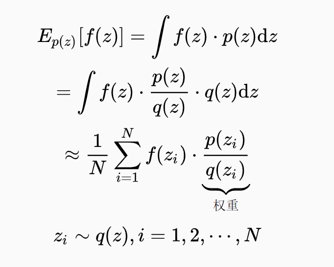

# Particle Filter
## 一、介绍
[README.md](../README.md)中介绍了Particle Filter与其它两个模型之间的区别与联系，Particle Filter和Kalman Filter一样都是解决通过观测变量对系统状态变量进行估计的问题(滤波问题)。不同的是，Particle Filter观测变量和状态变量可以是任意分布，
噪声可以是任意分布，且变量之间的关系可以是非线性的:

Zt = g(Zt-1 , u, ε) &nbsp;&nbsp;&nbsp;&nbsp;(1)

Zt = h(Xt, u, δ)  &nbsp;&nbsp;&nbsp;&nbsp;(2)

通过与[Kalman filter](Kalman_filter.md)关系式比较可以发现，Particle Filter的适用范围要大得多，但Particle filter
没法像Kalman filter一样对状态后验概率分布更新得到闭式解，只能通过Monte Carlo采样的方式得到近似解。具体来说，就是用一组粒子(采样样本)和粒子的权重来逼近系统状态的后验概率分布，
即通过一个离散的分布列来逼近一个连续的分布函数。

## 二、采样算法
这里主要介绍一下Particle Filter用到的一些采样算法。采样本质上是要解决求积分的问题，而所有积分问题都可以写成某个概率分布下期望的形式，
所以也可以等价地说采样是求某个期望的方法。

### 2.1 Monte Carlo Sampling(MCS)

### 2.2 Inportance Sampling(IS)
对于分布p(z)，要求期望Ep(z)[f(z)]，重要性采样的方法是引入一个新的分布q(z)，对q(z)采样，做法如下：

其中wi = p(zi)/q(xi)，称为样本的重要性权重。对应的采样分布q(z)称为提议分布(proposal distribution)。对于分布P可能很难直接从中进行采样，而Importance Sampling让我们可以
通过一个简单的分布q进行采样。

在滤波问题中，我们关心的是后验概率P(Zt|X1:t) = P(Zt|X1, X2, ... ,Xt)，权重就是：

### 2.3 Sequential Importance Sampling (SIS)
重要性采样的一个问题就是计算量过大，每一次要采样N次，对每个样本计算一次权重。我们希望权重可以有一个递推关系式来简化计算过程。
#### 2.3.1 SIS介绍

考虑一个高维空间，真实分布为p(X1:n)其中X1:n:=(X1， X2, ..., Xn)，提议分布为q(X1:n)，权重为w(X1:n)。
考虑一个特殊的情景，即我们需要从1维到n维依次采样，有没有办法用上次的权重进行新权重的计算(权重之间的递推关系式)？

得到如下关于权重的递推关系式，这样我们就可以通过上一维的权重直接计算当前维度的权重。

#### 2.3.2 SIS解决粒子滤波问题
如果我们将1:n转换成1:t，赋予维度一个时序的意义，就可以用它来解决particle filter中的重要性权重计算更新问题。在Particle Filter中为了计算的简便，
不直接用filtering 问题的后验概率P(Zt|X1:t)进行采样，而是用P(Z1:t|X1:t)，因为它们有如下关系：

对应Particle Filter的权重更新公式为：

#### 2.3.3 SIS提议分布的选取
选择恰当的提议分布是除了重采样之外，解决粒子退化(particle degeneracy)问题的方法。一个常用的选择是：

此时，SIS的权重递推关系式可简化为：

此时采样和权重更新就有点类似做前向预测(prediction)和修正(update)。

### 2.4 Sampling Importance Resampling (SIR)
传统粒子滤波使用SIS会引起粒子退化(particle degeneracy)，即随着迭代的进行，一些粒子归一化权重会趋于1，而很多粒子权重则趋于0。
这样的分布列并不能很好地代表系统状态后验分布，因为如果某粒子的归一化权重很小，它就不太可能被抽到，不该存在有很多粒子的归一化权重趋于0的情况，
因此以这些粒子的加权平均作为Filtering的估计是不准确的。

重采样就是解决粒子退化的一种方法，具体来说就是以各个粒子的归一化权重作为分布列，从中采出N个样本，采出的所有样本权重均为1/N。这样相当于复制权重较大的粒子，
抛弃权重较小的粒子，用新得到的粒子来拟合分布、进行状态估计。在SIS的基础上加上重采样和特定的提议分布就是重要性重采样(SIR)，算法流程如下：

## 三、效果

参考资料[2]的例子，进行particle filter(SIR)，结果如下所示：

在同样的条件下，每次迭代不进行重采样的结果为：

可以看到此时粒子的轨迹分成了两部分，而粒子的加权平均估计值在上面，说明出现了粒子退化问题。

## 四、参考资料

1. [https://www.jianshu.com/p/14ca1713378b](https://www.jianshu.com/p/14ca1713378b)
2. [https://zhuanlan.zhihu.com/p/135414835](https://zhuanlan.zhihu.com/p/135414835)